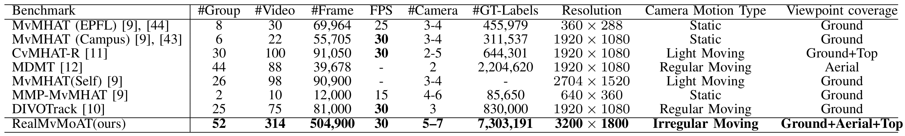

# RealMvMoAT: A Large-Scale Benchmark for Multi-View Pedestrian Association and Tracking on Mobile Aerial-Ground Platforms

## Overview

Welcome to the official repository of **RealMvMoAT**. RealMvMoAT is a large-scale, real-world dataset designed for evaluating Multi-view Multi-object Association and Tracking (MvMoAT) tasks in dynamic and mobile aerial-ground scenarios. Our dataset aims to push forward research on robust identity association and temporal tracking under substantial viewpoint variation and complex platform motion.

### Key Features of RealMvMoAT:
- **Diverse Camera Views**: Includes up to 7 synchronized cameras (5 UAV views and 2 ground views) to capture the same scenes from different perspectives.
- **Realistic Scenarios**: Captures 10 different outdoor environments (e.g., parks, lawns, basketball courts, and urban plazas) with dynamic platform motion (e.g., circular sweeps, hovering rotations, lateral panning, zigzag flight).
- **Large-Scale Data**: Comprising 52 synchronized video groups, 314 videos, 504,900 frames, and over 7.3 million annotated bounding boxes.
- **Temporal Consistency**: Ensures stable identity tracking over time with large viewpoint shifts and occlusions.

## Dataset Components

We are providing a portion of the RealMvMoAT dataset as part of this release, specifically the **training set**.

### Future Releases
Additional portions of the dataset, the test set, will be made available in the near future. Please stay tuned for further updates on this repository.

## Dataset Usage

The **training set** is available for download through the link below. You will find video frames, and annotations required for training multi-view pedestrian association and tracking models.

### Training Set Download

You can download the **training set** of RealMvMoAT using the following link:

[Download Training Set](https://pan.baidu.com/s/1BMLAmuyPlRzJ9t7RR6R7og?pwd=zubp) (Code: zubp)

**Note**:
1. Special clause for reviewers: the zip password is set as the manuscript ID from *ScholarOne Manuscripts* System (e.g., `TPAMI-2026-XX-XXXX`, `TCSVT-XXXXX-2025`). For non-reviewer requests, please contact wuruiqi.salon@mail.nwpu.edu.cn to request the password.
2. Your email request must include a completed application form.
3. Application form template: [Password Request Form](REALMVMOAT_PASSWORD_REQUEST_FORM.md)
4. The link above will direct you to the download page. Please review the terms and conditions before using the dataset for your research.

### Future Updates
We plan to release the **test set** soon. These will include additional videos frames and ground-truth annotations, allowing for more comprehensive evaluation of model performance.

## Citation

If you use RealMvMoAT in your research, please cite the following paper:

```bibtex
@article{wu2026fusion,
  title={Novel Framework and Benchmarks for Multi-View Pedestrian Association and Tracking on Mobile Aerial-Ground Platforms},
  author={Wu, Ruiqi and Jiao, Bingliang and Han, Ruize and Yu, Hangzheng and Jiang, Xunkai and Wang, Shining and Hu, Yuanqi and Wang, Wenxuan and Wang, Peng},
  journal={arXiv preprint arXiv:26XX.XXXX},
  year={2026}
}
```

## Visualizations

### Example Images

#### Sample Image
Here is an example image from the dataset to give you a sense of the diversity in the scenes:


#### Comparison Table
The following table compares RealMvMoAT with several existing MvMoAT benchmarks, showing the scale, camera motion, and viewpoint coverage:



### Multi-view Multi-object Association and Tracking

Here is a GIF showcasing Multi-view Multi-object Association and Tracking:


## License

This project is licensed under the Apache-2.0 License. Full license text: [LICENSE](LICENSE)


